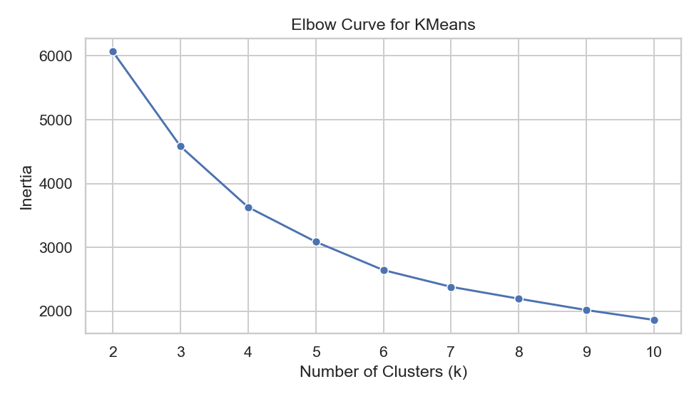
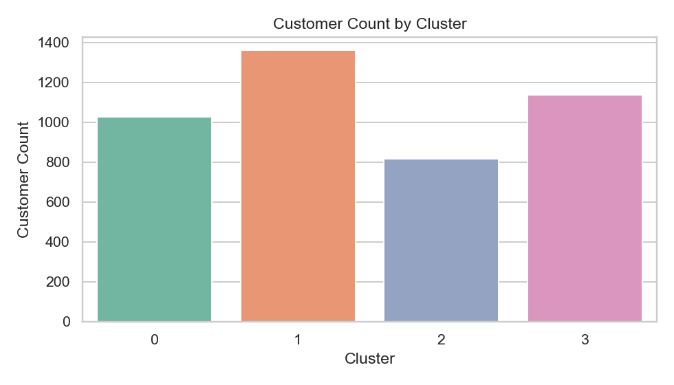
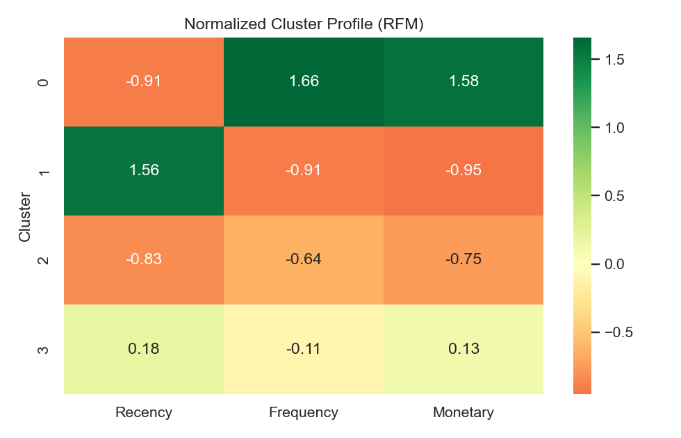
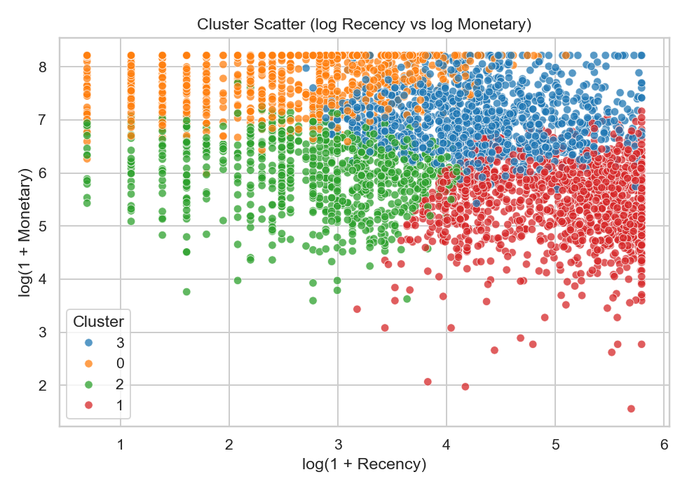

# Shopper Spectrum: Customer Segmentation and Recommendation

Customer analytics project using RFM features and unsupervised learning to segment ecommerce shoppers into business-actionable groups.

## Project Goals
- Build interpretable customer segments from transaction behavior.
- Validate segmentation quality with multiple clustering approaches.
- Translate segments into practical marketing/retention actions.
- Provide an interactive app for quick segment inference.

## Methods Used
- RFM Feature Engineering (Recency, Frequency, Monetary)
- Data Cleaning and Outlier Handling
- Univariate, Bivariate, and Multivariate EDA
- KMeans Clustering (primary segmentation model)
- Hierarchical Clustering (validation/supporting model)
- DBSCAN (outlier and density behavior exploration)

## Repository Structure
```text
Shopper-Spectrum-Customer-Segmentation-and-Recommendation-main/
├── Shopper_Spectrum_EDA_and_Clustering.ipynb
├── app.py
├── requirements.txt
├── README.md
├── .gitignore
├── data/
│   ├── README.md
│   └── raw/
│       └── .gitkeep
└── models/
```

## Dataset Setup (Required)
Expected raw file location:

`data/raw/online_retail.csv`

Steps:
1. Download/obtain the Online Retail transaction dataset.
2. Save it as `data/raw/online_retail.csv`.
3. Run notebook/app from repository root.

More details: `data/README.md`

## Installation
```bash
python3 -m pip install -r requirements.txt
```

## Run Notebook Workflow
Open and run:

`Shopper_Spectrum_EDA_and_Clustering.ipynb`

The notebook now reads data from `data/raw/online_retail.csv` and saves model artifacts to `models/`.

## Generate Reproducible Result Assets (Recommended Before Submission)
Run this once to regenerate final model artifacts and report figures:

```bash
python3 scripts/generate_results_assets.py
```

This creates:
- `models/rfm_scaler.joblib`
- `models/kmeans_rfm_model.joblib`
- `reports/results_summary.json`
- `reports/RESULTS_SUMMARY.md`
- `reports/figures/*.png`

## Run Streamlit App
```bash
streamlit run app.py
```

App expects:
- `models/rfm_scaler.joblib`
- `models/kmeans_rfm_model.joblib`

If missing, train/save models first via notebook.

## Outputs
- Trained artifacts:
  - `models/rfm_scaler.joblib`
  - `models/kmeans_rfm_model.joblib`
  - `models/hierarchical_rfm_model.joblib`
- Segmentation analysis and visuals in notebook
- Interactive customer segment prediction in Streamlit app

## Current Run Results
From the latest generated summary (`reports/results_summary.json`):
- Customers modeled: **4338**
- Clusters: **4**
- Silhouette score: **0.3477**

### Figure Preview
Elbow Curve  


Cluster Distribution  


Cluster Profile Heatmap  


Cluster Scatter (log Recency vs log Monetary)  


## Segment Interpretation (App)
- Cluster 0: High-value customers
- Cluster 1: Regular customers
- Cluster 2: Occasional customers
- Cluster 3: At-risk customers

(Cluster labels may vary depending on training run and initialization.)

## GitHub Notes
- Raw dataset files are excluded by `.gitignore`.
- Share repo without data; users can reproduce by placing dataset in `data/raw/`.
- This keeps repository lightweight and avoids privacy/size issues.

## Suggested Git Commands (Push to GitHub)
If this folder is not already a git repo:

```bash
cd "<your-folder>/Shopper-Spectrum-Customer-Segmentation-and-Recommendation-main"
git init
git add .
git commit -m "Finalize Shopper Spectrum project for submission"
git branch -M main
git remote add origin <your-github-repo-url>
git push -u origin main
```

If repo already exists:

```bash
cd "<your-folder>/Shopper-Spectrum-Customer-Segmentation-and-Recommendation-main"
git add .
git commit -m "Polish repo, paths, results assets, and docs"
git push
```

## Author
Sanjay
